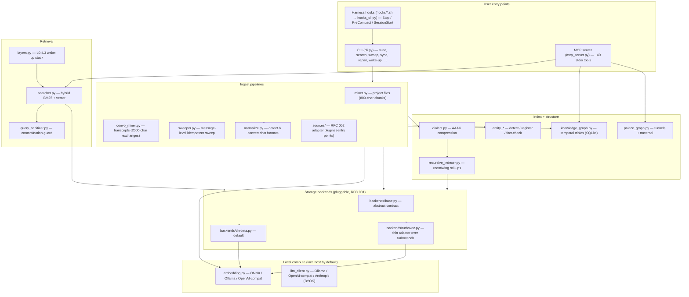

# Architecture

System map for MemPalace (v3.3.5). Read this first when starting feature work; drill into the per-area docs in [Detailed docs](#detailed-docs) when you need depth.

## What this system is

A local-first AI memory library. It ingests files and conversation transcripts, stores every word **verbatim** as chunked "drawers" in a pluggable vector store, builds a compact AAAK index over them, and serves recall through a CLI and an MCP server. A SQLite knowledge graph tracks temporal entity relationships alongside. **Nothing leaves the machine by default** — embedding and any optional LLM refinement run on localhost (ONNX/Ollama). External providers exist only via explicit BYOK and are never a silent fallback.

Hard rules — see [`CLAUDE.md`](../CLAUDE.md) and [`MISSION.md`](../MISSION.md):
 - **Verbatim always.** We index and return original words. No summarization, paraphrase, or lossy-compress of user data. (AAAK closets are an *additive index*, not a replacement for drawer content.)
 - **Incremental only.** Append-only after initial build. A crash mid-mine leaves the existing palace untouched; re-mine is idempotent via deterministic drawer IDs.
 - **Entity-first.** Memory is keyed by real names, disambiguated by relationship/DOB/context.
 - **Local-first, zero external API by default.** External calls are gated by `_endpoint_is_local()` and require deliberate configuration.
 - **Performance budgets.** Hooks under 500ms, wake-up injection under 100ms.
 - **Background everything.** Filing/indexing happens in hooks; zero tokens spent on bookkeeping in chat.

## High-level diagram



## The palace model (read once, recognize forever)

There are **no `Wing`/`Room`/`Drawer` classes** — the palace is defined by metadata on rows in a vector collection, plus a few sidecar stores.

```
PALACE (a directory, e.g. ~/.mempalace/palaces/chat/)
  WING   (project/domain)   → drawer metadata["wing"], normalized slug
    ROOM (day/topic)        → drawer metadata["room"]; room="general" is filler
      DRAWER (verbatim chunk) → row in `mempalace_drawers`, id = drawer_{wing}_{room}_{sha256(file+idx)[:24]}
```

Four collections per palace:

| Collection | Holds | Built by | Read by |
|---|---|---|---|
| `mempalace_drawers` | verbatim chunks + metadata, HNSW-indexed | miners | `searcher`, `layers` L1–L3 |
| `mempalace_closets` | AAAK pointer lines (`topic\|entities\|→drawer_ids`) | `build_closet_lines` / `closet_llm` | `searcher` themes path |
| `mempalace_room_indices` | room-level AAAK roll-ups (top-100 lines) | `recursive_indexer` | hierarchical search depth 1 |
| `mempalace_wing_indices` | wing-level AAAK roll-ups (top-200 lines) | `recursive_indexer` | hierarchical search depth 0 |

Sidecar stores (outside the vector collections):

| Store | Path | Holds |
|---|---|---|
| Knowledge graph | `<palace>/knowledge_graph.sqlite3` | temporal `entities` + `triples` (per-palace, isolated) |
| Tunnels | `~/.mempalace/tunnels.json` | explicit + topic cross-wing links (survives rebuild) |
| Entity registry | `~/.mempalace/entity_registry.json` | who-is-who + disambiguation + wiki cache |
| Dirty flags | `<palace>/.dirty/{rooms,wings}/*.json` | incremental re-index queue |
| Mine locks | `~/.mempalace/locks/*.lock` | per-palace + per-file write serialization |

## Layer 1 — Storage backends (RFC 001)

The single most important abstraction. Everything that persists drawers goes through it. Backends are selected per-palace and registered via the `mempalace.backends` entry-point group.

**Contract** — [`backends/base.py`](../mempalace/backends/base.py):
- `BaseCollection` (kwargs-only): `add`, `upsert`, `query`, `get`, `delete`, `count` are abstract; `estimated_count`, `close`, `health`, `update` have defaults.
- `BaseBackend`: `get_collection(palace, collection_name, create, options)` is abstract; `close_palace`, `close`, `health`, `detect` have defaults. Instances are lightweight — **no I/O in `__init__`**; connection work is deferred to `get_collection`.
- Value objects: `PalaceRef` (id / local_path / namespace), `QueryResult`, `GetResult`, `HealthStatus`.
- Errors: `BackendError`, `PalaceNotFoundError`, `BackendClosedError`, `UnsupportedFilterError`, `DimensionMismatchError`, `EmbedderIdentityMismatchError`.

**Selection priority** — `resolve_backend_for_palace()` in [`backends/registry.py`](../mempalace/backends/registry.py): explicit arg → per-palace config → `MEMPALACE_BACKEND` env → on-disk auto-detect (`backend_cls.detect(path)`) → default `"chroma"`.

| Backend | File | Notes |
|---|---|---|
| `chroma` (default) | [`backends/chroma.py`](../mempalace/backends/chroma.py) | ~1400 lines. Single collection per palace; HNSW cosine. Carries the HNSW health/repair machinery: stale-segment quarantine, blob seq-id migration, divergence probes, write serialization via `mine_palace_lock`. `detect`: presence of `chroma.sqlite3`. |
| `turbovec` (experimental) | [`backends/turbovec.py`](../mempalace/backends/turbovec.py) | ~220 lines. Thin delegate over the external `turbovecdb` library (4-bit ANN + durable SQLite, exact cosine re-rank). Per-collection dirs under `<palace>/turbovec/`. `detect`: presence of `turbovec/`. Translates `DimensionMismatchError`/`UnsupportedFilterError` from turbovecdb. |

Both lazily embed at query time via `_lazy_embedder()` so precomputed-embedding writes (mining) skip model load.

## Layer 2 — Local compute

[`embedding.py`](../mempalace/embedding.py) `get_embedding_function(device)` is the single resolver, cached per provider+key.

| Provider | Trigger | Endpoint default | Default model / dim |
|---|---|---|---|
| `onnx` (default) | none — always local | n/a | `all-MiniLM-L6-v2`, **384-dim** (spoofs `name()="default"` for Chroma compat) |
| `ollama` | `MEMPALACE_EMBEDDING_PROVIDER=ollama` | `localhost:11434` | `nomic-embed-text`, 768-dim |
| `openai-compat` | `MEMPALACE_EMBEDDING_PROVIDER=openai-compat` | `localhost:8000` | `nomic-ai/nomic-embed-text-v1.5` (covers vLLM/LM Studio/llama.cpp/OpenAI) |

[`llm_client.py`](../mempalace/llm_client.py) `get_provider(name, model, endpoint, api_key)` mirrors this for **optional, opt-in** text generation (entity refinement, LLM closets, taxonomy). Providers: `OllamaProvider`, `OpenAICompatProvider`, `AnthropicProvider` (always external, BYOK). The **privacy gate** is `_endpoint_is_local()` — treats localhost, `.local`, RFC1918, Tailscale CGNAT, and IPv6 ULA as on-machine; everything else flips `is_external_service` true. The default miner runs **no LLM**.

> **Verbatim check.** `llm_refine.py`, `closet_llm.py`, `closet_taxonomy.py` all produce *metadata only* — they never modify drawer content. `spellcheck.py` corrects user messages pre-file but is local and degrades to pass-through. This is the one place to watch when adding LLM calls; keep the [LLM Pipeline Design Rule](../CLAUDE.md) in mind.

## Layer 3 — Ingest

Every miner uses [`parallel.py`](../mempalace/parallel.py)'s `ParallelPipeline`: N producer threads (read → chunk → embed) + **one** consumer thread (upsert under `mine_lock`, because hnswlib demands single-threaded writes). Idempotency comes from deterministic drawer IDs + `file_already_mined()` mtime/`normalize_version` checks.

| Pipeline | File | Chunking | Idempotency key |
|---|---|---|---|
| Project files | [`miner.py`](../mempalace/miner.py) | 800 chars, 100 overlap, break at `\n\n`/`\n`; max 500 chunks/file | `sha256(source_file + chunk_index)` |
| Transcripts | [`convo_miner.py`](../mempalace/convo_miner.py) | 2000 chars by exchange-pair (user turn + AI response); paragraph fallback | same, per source+index |
| Message-level | [`sweeper.py`](../mempalace/sweeper.py) | one message = one drawer | per-message; cursor = `max(timestamp)`, skips `< cursor` (not `<=`, to survive tied timestamps) |

Supporting cast: [`normalize.py`](../mempalace/normalize.py) detects and converts Claude Code / Codex / Gemini / Claude.ai / ChatGPT / Slack formats to a `>`-delimited transcript and strips harness noise; [`convo_scanner.py`](../mempalace/convo_scanner.py) recovers real project names from Claude `cwd`; [`corpus_origin.py`](../mempalace/corpus_origin.py) detects AI-dialogue + persona names; [`general_extractor.py`](../mempalace/general_extractor.py) classifies chunks (decision/preference/milestone/problem/emotion) when `extract_mode="general"`. Ignore handling: one convention per project (`.mempalaceignore` else `.gitignore`), never per-directory — see [`docs/MEMPALACEIGNORE.md`](MEMPALACEIGNORE.md).

[`sync.py`](../mempalace/sync.py) (`sync_palace`) is the inverse: prune drawers whose source is gitignored/deleted/moved. Classifies each drawer `kept | gitignored | missing | no_source | out_of_scope`; requires explicit `wing=`/`project_dirs=` on apply to prevent mass-prune.

**Source adapters (RFC 002)** — [`sources/`](../mempalace/sources/) is the forward-looking plugin contract (`BaseSourceAdapter.ingest()` yields `DrawerRecord`s into a `PalaceContext`; registered via `mempalace.sources` entry points; declared `transforms` keep ingestion auditable). Core ships none yet; `miner`/`convo_miner` migrate onto it in a follow-up. See [`docs/rfcs/002-source-adapter-plugin-spec.md`](rfcs/002-source-adapter-plugin-spec.md).

## Layer 4 — Index + structure

- **AAAK** — [`dialect.py`](../mempalace/dialect.py). A lossy, decoder-free symbolic format an LLM reads natively. Two shapes: closet pointer lines `topic|entity;entity|→drawer_a,drawer_b` and full zettel lines `ZID:ENTITIES|topics|"quote"|weight|EMOTIONS|FLAGS`. The roll-up projections (`parse_closet_line`, `project_closet_lines`, `frequency_top_n`, `aggregate_entity_sets`) are **pure and deterministic** — no LLM, no drift.
- **Recursive index** — [`recursive_indexer.py`](../mempalace/recursive_indexer.py). Rolls leaf closets up to room (top-100) then wing (top-200) AAAK docs, capped at 3000 chars (embedder token budget). `rebuild_dirty()` drains the dirty-flag queue under `mine_lock`; `rebuild_all()` rebuilds from scratch.
- **Palace graph** — [`palace_graph.py`](../mempalace/palace_graph.py). Passive edges (same room name across wings, cached 60s TTL), explicit tunnels (agent-created, symmetric-hash dedup, persisted), and topic tunnels (auto from shared topics). `traverse` BFSes connected rooms; `find_tunnels` bridges two wings.
- **Knowledge graph** — [`knowledge_graph.py`](../mempalace/knowledge_graph.py). Per-palace SQLite (WAL). `entities(id, name, type, properties)` + `triples(subject, predicate, object, valid_from, valid_to, confidence, source_drawer_id, adapter_name, …)`. Temporal: a fact is current when `valid_to IS NULL`, valid as-of D when `valid_from ≤ D AND (valid_to IS NULL OR valid_to ≥ D)`; inverted intervals rejected at write. `add_triple`, `query_entity(as_of, direction)`, `invalidate`, `timeline`, `stats`.
- **Entities** — [`entity_detector.py`](../mempalace/entity_detector.py) (regex/i18n scoring, person-vs-project signals, **no LLM/NER**), [`entity_registry.py`](../mempalace/entity_registry.py) (persistent who-is-who; disambiguates names-that-are-common-words via context patterns; Wikipedia lookup is network-gated off by default), [`fact_checker.py`](../mempalace/fact_checker.py) (offline `similar_name` / `relationship_mismatch` / `stale_fact` checks against registry + KG).

## Layer 5 — Retrieval

[`searcher.py`](../mempalace/searcher.py) is the recall engine. Public surface: `search_memories()` (thin wrapper) → `search_within()` (scoped primitive). It **over-fetches 3×** then reranks via `_hybrid_rank()`: `0.6·vec_sim + 0.4·bm25_norm`, where `vec_sim = max(0, 1 − distance)` (absolute, not relative-to-max, so candidate set changes don't reshuffle) and BM25 uses a smoothed-IDF Okapi over the candidate set. Two separate result lists: `primary` (drawers, authoritative) and `themes` (closets, advisory, taxonomy-penalized). When HNSW is corrupt/unloadable, `_bm25_only_via_sqlite()` routes through ChromaDB's FTS5 trigram index — **no silent failure mode**, which is how the 100%-recall target survives index damage.

[`layers.py`](../mempalace/layers.py) — the L0–L3 wake-up stack:

| Layer | Source | Cost | When |
|---|---|---|---|
| L0 identity | `~/.mempalace/identity.txt` | ~100 tok | always |
| L1 essential story | top-15 drawers by importance, grouped by room | ~500–800 tok | always |
| L2 on-demand | wing/room-filtered `get` | ~200–500 tok | on demand |
| L3 deep search | full hybrid search | unbounded | on demand |

`MemoryStack.wake_up()` = L0+L1 (~600–900 tok, the rest of context stays free). [`query_sanitizer.py`](../mempalace/query_sanitizer.py) guards against agents prepending system prompts to queries (passthrough ≤200 chars → question extraction → tail sentence → last-250-char fallback; recovers R@10 from ~1% to ~70–89%). Hierarchical search prunes wing-index → room-index → drawers before paying for leaf search. See [`docs/design/two-tier-retrieval.md`](design/two-tier-retrieval.md).

## Entry points

| Surface | File | What |
|---|---|---|
| CLI | [`cli.py`](../mempalace/cli.py) (`mempalace`) | `init`, `mine`, `search`, `sweep`, `sync`, `split`, `wake-up`, `status`, `compress`, `repair`/`repair-status`, `migrate`, `mcp`, `hook run`, `instructions` |
| MCP | [`mcp_server.py`](../mempalace/mcp_server.py) (`mempalace-mcp`) | ~40 stdio tools: read (`status`, `list_wings/rooms`, `get/list_drawers`, `get_taxonomy`, `traverse`), search (`search`, `search_hierarchical`, `check_duplicate`), write (`add/update/delete_drawer`, `sync`), KG (`kg_add/query/invalidate/timeline/stats`), tunnels (`create/list/delete/find/follow_tunnels`, `graph_stats`), diary (`diary_read/write`), `hook_settings`, `reconnect` |
| Hooks | [`hooks/`](../hooks) → [`hooks_cli.py`](../mempalace/hooks_cli.py) | `Stop` (block every `SAVE_INTERVAL=15` exchanges → checkpoint), `PreCompact` (mine transcript before compaction), `SessionStart` (Cursor). Shell scripts shell back into `mempalace mine`; detached subprocess with per-target PID guards. See [`hooks/README.md`](../hooks/README.md). |

Palace selection: `--palace` alias/path on CLI; `palace=` arg on MCP tools; else `MEMPALACE_PALACE_PATH` env, walk-up `mempalace.yaml`, or `default_palace` in `~/.mempalace/config.json`. No implicit fallback — undeclared palace raises `PalaceNotDeclared`. Config + sanitizers live in [`config.py`](../mempalace/config.py) (`sanitize_name`, `sanitize_content`, `sanitize_kg_value`, `sanitize_iso_temporal`).

## Maintenance & recovery

ChromaDB's async HNSW flush + unbounded `link_lists.bin` growth is the main failure source, so [`repair.py`](../mempalace/repair.py) carries an escalation ladder: `status` (read-only capacity probe) → `scan` (find corrupt ids) → `prune` (surgical delete) → `rebuild_index` (extract → backup sqlite → recreate → re-upsert, with a SQLite ground-truth safety check) → `rebuild_from_sqlite` (bypass the broken Chroma read path entirely). [`dedup.py`](../mempalace/dedup.py) removes near-duplicate drawers (cosine-distance threshold 0.15 default). [`migrate.py`](../mempalace/migrate.py) handles ChromaDB version mismatches; [`exporter.py`](../mempalace/exporter.py) writes per-wing/room markdown.

## Recurring concepts

- **Verbatim + additive index.** Drawers are the source of truth; closets/indices/KG are derived pointers. Never let a derived layer overwrite a drawer.
- **Deterministic IDs + dirty flags.** Re-mine is idempotent; only changed (wing, room) pairs re-index. Survives crashes and concurrent miners.
- **One writer.** All vector writes serialize through `mine_palace_lock`/`mine_lock`; HNSW is not thread-safe.
- **No silent failure for recall.** Corrupt index → BM25/SQLite fallback, contaminated query → sanitizer, missing metadata → graceful field defaults. 100% recall is the bar everything degrades *toward*, never away from.
- **Local by gate, not by hope.** `_endpoint_is_local()` is the choke point; external compute is opt-in and visible.
- **Pluggable at two seams.** Storage (RFC 001, `mempalace.backends`) and sources (RFC 002, `mempalace.sources`) are entry-point plugins with versioned contracts.

## Common task → start here

| If you want to… | Open this first |
|---|---|
| Add a storage backend | [`backends/base.py`](../mempalace/backends/base.py) contract + [`backends/turbovec.py`](../mempalace/backends/turbovec.py) as the minimal example; register in `pyproject.toml` `mempalace.backends` |
| Add a content source | [`sources/base.py`](../mempalace/sources/base.py) `BaseSourceAdapter` + [`docs/rfcs/002-source-adapter-plugin-spec.md`](rfcs/002-source-adapter-plugin-spec.md) |
| Change search ranking | `_hybrid_rank()` / `_bm25_scores()` in [`searcher.py`](../mempalace/searcher.py) |
| Change chunking | `chunk_text()` in [`miner.py`](../mempalace/miner.py) or `chunk_exchanges()` in [`convo_miner.py`](../mempalace/convo_miner.py) |
| Add an MCP tool | TOOLS dict + handler in [`mcp_server.py`](../mempalace/mcp_server.py) |
| Add a CLI command | dispatch dict + `cmd_*` in [`cli.py`](../mempalace/cli.py) |
| Touch the AAAK format | [`dialect.py`](../mempalace/dialect.py) (encode/projections) — keep projections pure |
| Change embedding provider behavior | `get_embedding_function()` in [`embedding.py`](../mempalace/embedding.py); endpoint gate in [`llm_client.py`](../mempalace/llm_client.py) |
| Recover a broken palace | [`repair.py`](../mempalace/repair.py) `status` → `scan` → `prune` → `rebuild_*` |
| Add/query temporal facts | [`knowledge_graph.py`](../mempalace/knowledge_graph.py) `add_triple` / `query_entity(as_of=…)` |
| Tune hook save cadence | `SAVE_INTERVAL` in [`hooks/mempal_save_hook.sh`](../hooks/mempal_save_hook.sh); behavior flags via `mempalace_hook_settings` |
| Resolve a palace path | `resolved_palace_path()` in [`config.py`](../mempalace/config.py) |

## Detailed docs

| Need | File |
|---|---|
| Closet/index layer | [`docs/CLOSETS.md`](CLOSETS.md) |
| Two-tier retrieval design | [`docs/design/two-tier-retrieval.md`](design/two-tier-retrieval.md) |
| Palace isolation invariant | [`docs/design/palace-isolation.md`](design/palace-isolation.md) |
| Parallel mining design | [`docs/design/embrace-parallelism.md`](design/embrace-parallelism.md) |
| Splitting a palace | [`docs/SPLITTING_A_PALACE.md`](SPLITTING_A_PALACE.md) |
| `.mempalaceignore` semantics | [`docs/MEMPALACEIGNORE.md`](MEMPALACEIGNORE.md) |
| Storage backend contract (RFC 001) | [`backends/base.py`](../mempalace/backends/base.py) |
| Source adapter contract (RFC 002) | [`docs/rfcs/002-source-adapter-plugin-spec.md`](rfcs/002-source-adapter-plugin-spec.md) |
| Project history | [`docs/HISTORY.md`](HISTORY.md) |
| Schema | [`docs/schema.sql`](schema.sql) |
